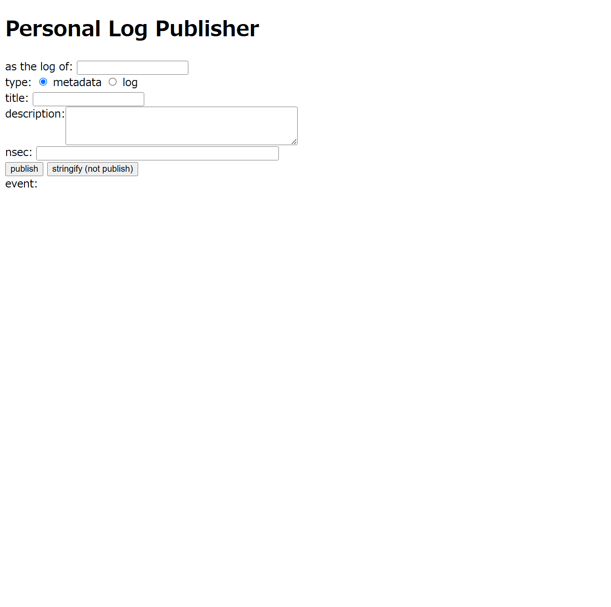

# Personal Log Publisher

Personal Log Publisher is to publish personal log events (unofficial kind 1081 and kind 31081).

https://asaitoshiya.github.io/nostr-toybox/personal-log-publisher/

<kbd></kbd>

## License

    Copyright (C) 2024  Asai Toshiya

    This program is free software: you can redistribute it and/or modify
    it under the terms of the GNU Affero General Public License as published by
    the Free Software Foundation, either version 3 of the License, or
    (at your option) any later version.

    This program is distributed in the hope that it will be useful,
    but WITHOUT ANY WARRANTY; without even the implied warranty of
    MERCHANTABILITY or FITNESS FOR A PARTICULAR PURPOSE.  See the
    GNU Affero General Public License for more details.

    You should have received a copy of the GNU Affero General Public License
    along with this program.  If not, see <https://www.gnu.org/licenses/>.
