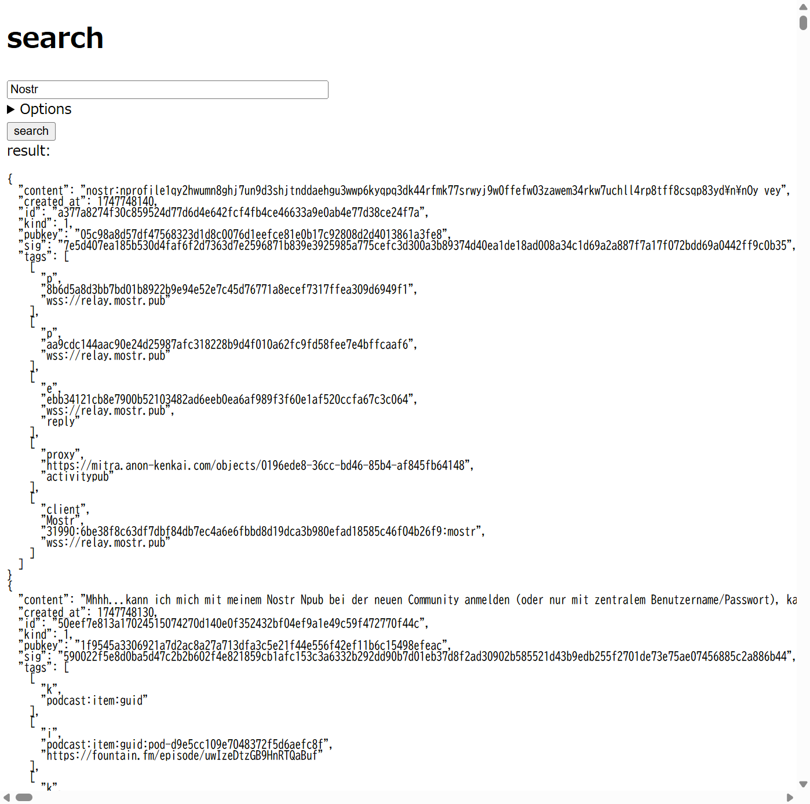

# search

broadcastr is an ultra-simple [NIP-50](https://github.com/nostr-protocol/nips/blob/master/50.md) client (powered by [Nostr.Band Relay](https://relay.nostr.band/index.html)).

https://asaitoshiya.github.io/nostr-toybox/search/

<kbd></kbd>

## License

CC0 1.0. See `LICENSE.txt`.
