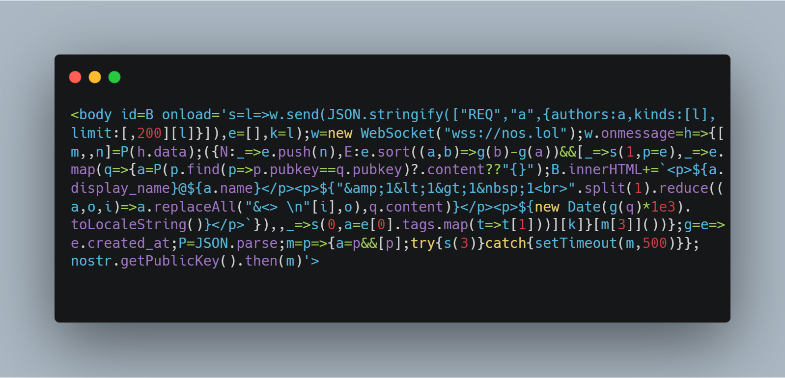

日本語 | [English](./README-en.md)

# 7 行の Nostr クライアント (タイムライン ビューアー)

https://asaitoshiya.github.io/nostr-toybox/seven/

動作には [NIP-07](https://github.com/nostr-protocol/nips/blob/master/07.md) の拡張機能が必要です。

現在は 9 行 (684 バイト) です。

## License

    Copyright (C) 2023  Asai Toshiya

    This program is free software: you can redistribute it and/or modify
    it under the terms of the GNU Affero General Public License as published by
    the Free Software Foundation, either version 3 of the License, or
    (at your option) any later version.

    This program is distributed in the hope that it will be useful,
    but WITHOUT ANY WARRANTY; without even the implied warranty of
    MERCHANTABILITY or FITNESS FOR A PARTICULAR PURPOSE.  See the
    GNU Affero General Public License for more details.

    You should have received a copy of the GNU Affero General Public License
    along with this program.  If not, see <https://www.gnu.org/licenses/>.
